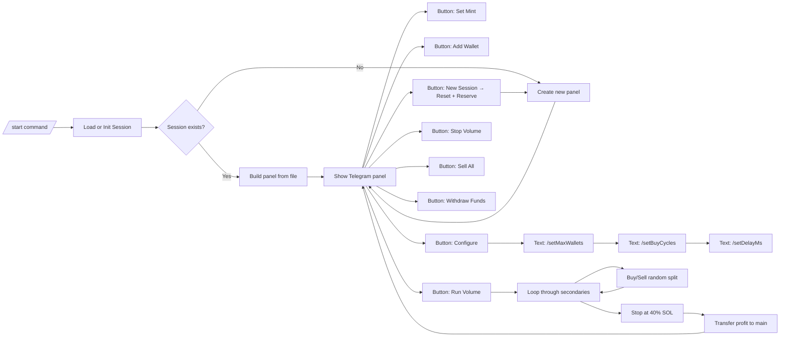

<p align="center">
  
</p>

<p align="center">
  
  
  
  
  
  
  
  
  
  
  
  
</p>

---

# 📈 Voluminoucious Bot for Solana on Telegram

---

## 🎯 1. Introduction

**Voluminoucious Bot** is a Telegram-based trading assistant designed for the Solana blockchain. It offers:

* **Automated volume trading** cycles on any SPL token.
* **Management of multiple wallets** per user: one **main** and configurable **secondary** wallets.
* **Deposit splitting**, execution of randomized buy/sell cycles, and stopping at a safe threshold.
* **Platform fee reservation**: 38% of the deposit is reserved for platform fees.
* **Secure state persistence** using AES-GCM–encrypted storage, ensuring session continuity.
* **Live token metrics** fetched from CoinGecko, including price, market cap, volume, supply, rank, and percentage changes.
* **Interactive Telegram panel** with actions to:

  * Start/Reset session
  * Add wallet
  * Set token mint
  * Configure parameters
  * Run/Stop volume trading
  * Sell all tokens back to SOL
  * Withdraw all SOL

---

## ⚙️ 2. Architecture & Data Flow



---

## 📦 3. Prerequisites

* **Node.js v16+**
* **npm**
* A **Telegram bot token** (obtainable via [BotFather](https://t.me/BotFather))
* A **Solana Devnet RPC URL**
* A **32-byte base64 AES key** for encrypted storage
* A **fee collection wallet** (public key) for platform fees

---

## 🔧 4. Installation & Start

```bash
git clone https://github.com/MaliosDark/voluminoucious-bot.git
cd voluminoucious-bot
npm install
npm start 
```

---

## 📝 5. Configuration

Create a `.env` file in the project root:

```ini
TELEGRAM_TOKEN=<your-telegram-bot-token>
RPC_URL=https://api.devnet.solana.com
DB_KEY=<32-byte-base64-string>
FEE_WALLET=<YourFeeWalletPublicKey>
```

* **`DB_KEY`**: Generate a secure 32-byte key, e.g., using `openssl rand -base64 32`.
* **`FEE_WALLET`**: Public key where platform fees are collected.

---

## 🔍 6. Session Structure

Each user session is identified by their **Telegram username** or **user ID**. The session structure includes:

```js
{
  main: Keypair,                    // Main wallet for deposits and consolidation
  secondaries: Keypair[],           // Array of secondary wallets
  tokenMint: string | null,         // SPL token address
  panelMsg: { chat_id, message_id },// Telegram panel reference
  stats: { initial, final, actions, start } | null,
  config: { maxWallets, buyCycles, delayMs },
  geckoCache: { ts, info } | null   // Cached CoinGecko data
}
```

* Sessions are **encrypted** using AES-GCM and stored in `.data-voluminousy/sessions.enc`.

---

## 🗺️ 7. Commands & Buttons

### 7.1 Telegram Buttons

| Button         | Description                                             |
| -------------- | ------------------------------------------------------- |
| 🆕 New Session | Reset session—collect all funds to fee wallet + reserve |
| ➕ Add Wallet   | Create another secondary wallet                         |
| 💳 Set Mint    | Prompt for SPL mint to trade                            |
| ⚙️ Configure   | Shows text commands for advanced configuration          |
| 🚀 Run Volume  | Begin buy/sell automation                               |
| 🛑 Stop        | Immediately halt volume job                             |
| 💸 Sell All    | Liquidate all SPL tokens → SOL, transfer to main        |
| 🏦 Withdraw    | Transfer all SOL from main → user’s address             |
| 🔍 Show Main   | Display main wallet balances                            |
| ℹ️ Show Stats  | Show elapsed time, actions, profit                      |

### 7.2 Text Commands

```text
/setMaxWallets <n>   — Limit of secondary wallets (1–50)
/setBuyCycles <n>    — Number of randomized buy/sell cycles
/setDelayMs <ms>     — Delay between swap transactions (ms)
```

---

## ⚙️ 8. Typical Workflow

1. **/start**: Bot loads or initializes session and sends control panel.
2. **Deposit**: Send ≥0.5 SOL to the **main** wallet address displayed via "Show Main".
3. **Set Mint**: Use the button to specify the SPL token to trade.
4. **Add Wallet**: Create up to `maxWallets` secondary wallets.
5. **Run Volume**:

   * Bot reserves 38% of the main wallet's balance to the fee wallet.
   * Remaining SOL is split randomly among secondary wallets.
   * Each secondary performs randomized buy/sell cycles.
   * Trading halts when a wallet's SOL balance drops below 40%.
   * Profits are consolidated back into the main wallet.
6. **Stop**: Halt the trading process at any time.
7. **Sell All**: Convert all SPL tokens back to SOL and transfer to the main wallet.
8. **Withdraw**: Send all SOL from the main wallet to the user's Solana address.

---

## 🛠️ 9. Error Handling & Resilience

* **Robust Error Handling**: All asynchronous operations are wrapped in try/catch blocks to log errors and notify users.
* **Session Persistence**: Sessions are automatically saved after each state change.
* **Periodic Panel Refresh**: The Telegram panel is updated every 60 seconds to reflect the latest status.
* **Safe Session Reset**: The "New Session" action ensures all funds are collected to the fee wallet, preventing stranded assets.

---

## 🔄 10. Fee Structure

* **Platform Reserve**: 38% of the main wallet's balance is transferred to the fee wallet at the start of a volume run.
* **Optional Transaction Fee**: An additional 1% fee per transaction can be enabled by uncommenting the relevant lines in the code.

---

## 📊 11. Token Metrics Integration

The bot fetches real-time token data from CoinGecko, including:

* **Price**: Current USD price.
* **Market Cap**: Total market capitalization.
* **Volume (24h)**: Trading volume over the past 24 hours.
* **Circulating Supply**: Number of tokens in circulation.
* **Total Supply**: Total number of tokens.
* **Price Changes**: Percentage changes over 1h, 24h, and 7d.
* **Rank**: Market cap rank.

This information is displayed in the Telegram panel for user reference.

---

## 🔐 12. Security Considerations

* **Encrypted Storage**: All session data is encrypted using AES-GCM.
* **Key Management**: Private keys are securely managed within the application.
* **User Authentication**: Actions are tied to the user's Telegram ID to prevent unauthorized access.


