<p align="center">
  
</p>

<p align="center">
  
  
  
  
  
  
  
  
  
  
  
  
  
</p>

---

# 📈 Voluminoucious Bot for Solana on Telegram

---

## 🎯 1. Introduction

Voluminoucious Bot is an **advanced volume-boosting** assistant for any SPL token on Solana.
It offers:

* **Per-chat sessions** (group or private), keyed by `chat.id`, isolating each user or chat.
* **Admin override**: The admin (specified by `ADMIN_USERNAME` in `.env`) can bypass the 0.5 SOL minimum for testing.
* **Interactive SPL-mint setup** with inline rate (“buys per minute”) selection.
* **Auto-watcher** for deposits: once ≥ 0.5 SOL arrives (or immediately for admin), the bot starts boosting.
* **Multiple secondary wallets**: configurable up to `maxWallets`.
* **Randomized buy/sell cycles** on secondaries, leaving 40% as profit.
* **Fee reservation**: 38% of deposit goes to a platform fee wallet; optional additional 1% per run.
* **“Sell All”** and **“Withdraw”** actions with address-prompt flows.
* **Live panel updates** every 30 s with profits, balances, stats.
* **Console logging** (via `chalk`) for every major action.
* **AES-GCM encrypted** session persistence.
* **CoinGecko integration** for token metrics (price, cap, volume, supply, rank, changes).

---

## ⚙️ 2. Architecture & Data Flow

```mermaid
flowchart TD
  Start[/User sends /start/] --> Load[Load or Init Session]
  Load --> Check{Session Exists?}
  Check -- Yes --> Reset[Reset awaiting mint]
  Check -- No --> Init[Create new session]

  Reset --> Welcome[Send welcome image and ask for SPL token mint]
  Init --> Welcome

  Welcome --> InputMint[User sends SPL token mint]
  InputMint --> FetchInfo[Fetch token info from CoinGecko]
  FetchInfo --> ShowInfo[Display token info]
  ShowInfo --> AskRate[Prompt user to select buy rate]
  AskRate --> SetRate[User selects buys per minute]
  SetRate --> BuildPanel[Build control panel]
  BuildPanel --> Watcher[Start deposit watcher]

  Watcher --> CheckDeposit{Balance >= 0.5 SOL or admin?}
  CheckDeposit -- No --> Wait[Wait for deposit]
  CheckDeposit -- Yes --> Boost[Deposit detected, start volume run]

  subgraph VolumeRun [Volume Run]
    Boost --> Reserve[Send 38% to fee wallet]
    Reserve --> OptionalFee[Send 1% fee]
    OptionalFee --> Split[Split SOL to secondary wallets]
    Split --> TradeLoop[Execute buy/sell cycles]
    TradeLoop --> CheckWallet{SOL > 0.4 left?}
    CheckWallet -- Yes --> Continue[Continue trading]
    CheckWallet -- No --> Collect[Move SOL back to main wallet]
    Collect --> SaveStats[Save final stats]
  end

  SaveStats --> Notify[Notify user: run completed]

  subgraph Controls [User Actions]
    Notify --> Stop[🛑 Stop: halt trading]
    Notify --> SellAll[💸 Sell All: tokens to SOL]
    Notify --> Withdraw[🏦 Withdraw: send SOL to user]
    Notify --> ShowMain[🔍 Show Main wallet info]
    Notify --> ShowStats[ℹ️ Stats: show summary]
    Notify --> NewSession[🆕 New Session]
  end

```



---

## 📦 3. Prerequisites

* **Node.js v16+**, npm
* **Telegram bot token** (from [BotFather](https://t.me/BotFather))
* **ADMIN\_USERNAME** (your Telegram username)
* **Solana RPC URL** (e.g. devnet)
* **DB\_KEY**: 32-byte base64 for AES-GCM (e.g. `openssl rand -base64 32`)
* **FEE\_WALLET**: Public key for platform fee collection

`.env` example:

```ini
TELEGRAM_TOKEN=123456:ABC-DEF...
ADMIN_USERNAME=YourTelegramUsername
RPC_URL=https://api.devnet.solana.com
DB_KEY=<32-byte-base64>
FEE_WALLET=YourFeeWalletPubKey
```

---

## 🔧 4. Installation

```bash
git clone https://github.com/MaliosDark/voluminoucious-bot.git
cd voluminoucious-bot
npm install
```

---

## 📝 5. Configuration & Environment

Create `.env` in the root with **all five** keys:
`TELEGRAM_TOKEN`, `ADMIN_USERNAME`, `RPC_URL`, `DB_KEY`, `FEE_WALLET`.

---

## 🗺️ 6. Session Data Model

Each `sessions[chatId]` contains:

```js
{
  main: Keypair,               // main SOL wallet
  secondaries: Keypair[],      // SPL trading wallets
  tokenMint: string | null,    // SPL token address
  buyRate: number | null,      // buys per minute
  withdrawTarget: string | null,
  stats: { initial, final, actions, start } | null,
  config: { maxWallets, buyCycles, delayMs },
  geckoCache: { ts, info } | null,
  panelMsg: { chat_id, message_id } | null,
  awaiting: 'mint'|'rate'|'withdraw'|null,
  depositWatcher: Interval | null
}
```

All fields are **AES-GCM** encrypted at rest.

---

## 🗨️ 7. Commands & Buttons

### 7.1 Inline Buttons

| Button               | Description                                                                        |
| -------------------- | ---------------------------------------------------------------------------------- |
| 🆕 **New**           | Reset session, collect all SOL → fee wallet & reserve; start over                  |
| ➕ **Add**            | Create a new secondary wallet                                                      |
| 💳 **Set Mint**      | Prompt for a new SPL token mint                                                    |
| ⚙️ **Config**        | Show text commands: `/setMaxWallets`, `/setBuyCycles`, `/setDelayMs`               |
| 🚀 **Run**           | Manually trigger a runVolume check (will still wait for deposit or admin override) |
| 🛑 **Stop**          | Cancel the running volume job                                                      |
| 🔍 **Main**          | Show main wallet address & balances                                                |
| ℹ️ **Stats**         | Show elapsed time, trades count, profit                                            |
| 💸 **Sell All**      | Swap all secondary tokens → SOL & transfer to main                                 |
| 🏦 **Confirm WD**    | Immediately withdraw all SOL from main → `withdrawTarget`                          |
| ✏️ **Withdraw Addr** | Prompt to set your withdrawal address                                              |

### 7.2 Slash-Commands

```txt
/setMaxWallets <n>  — Set maximum secondary wallets (1–50)
/setBuyCycles <n>   — Set number of buy/sell cycles per loop
/setDelayMs <ms>    — Set delay (ms) between swaps
```

---

## ⚙️ 8. Example Workflows

### 8.1 Normal User

1. `/start` → Bot sends **welcome.png**, “Send SPL token mint”
2. User sends `88dnPHaZDx…` → Bot fetches CoinGecko, asks “How fast?”
3. User taps `20` → Bot shows panel, “Waiting for deposit of ≥ 0.5 SOL…”
4. User sends 0.5 SOL → Deposit watcher triggers → “Deposit detected! Starting boost now.”
5. Bot reserves 38% + 1%, splits remaining SOL across secondaries, begins randomized buys/sells.
6. Panel auto-refresh every 30 s shows live balances & profit.
7. User taps **Sell All** → All tokens liquidated & moved to main.
8. User taps **Withdraw Addr**, sends their address → taps **Confirm WD** → SOL sent.

### 8.2 Admin Testing

1. `/start` → same mint & rate flows.
2. At rate selection, after panel appears, bot immediately says “Waiting for deposit…”
3. Admin (your `ADMIN_USERNAME`) with zero SOL bypasses deposit minimum → bot starts instantly.
4. All logs appear in console (colored via `chalk`).

---

## 🛠️ 9. Fee & Profit Details

* **Platform Reserve**: 38% of initial main balance goes to your `FEE_WALLET`.
* **Optional 1% Run Fee**: Additional 1% fee per run (configurable in code).
* **Profit**: The 40% leftover after each secondary drains triggers stop; profit consolidated back to main.

---

## 📊 10. Token Metrics & Logging

* **CoinGecko** fetch every 5 minutes (cached) for:

  * Price (USD)
  * Market Cap
  * 24 h Volume
  * Circulating / Total Supply
  * Price Δ% (1 h, 24 h, 7 d)
  * Rank
* **Console Logs** (via `chalk`):

  * Session init / reset
  * Reserve & fee transfers
  * Split distribution
  * Swap actions on each secondary
  * Deposit detection & run start
  * Sell All & Withdraw events

---

## 🔐 11. Security & Resilience

* **AES-GCM** encryption of all session data.
* **Admin override** only for your username.
* **Try/Catch** around every async block to prevent crashes.
* **Auto-save** after each state change ensures crash recovery.

---

## 📜 12. License

Licensed under the [MIT License](LICENSE).
